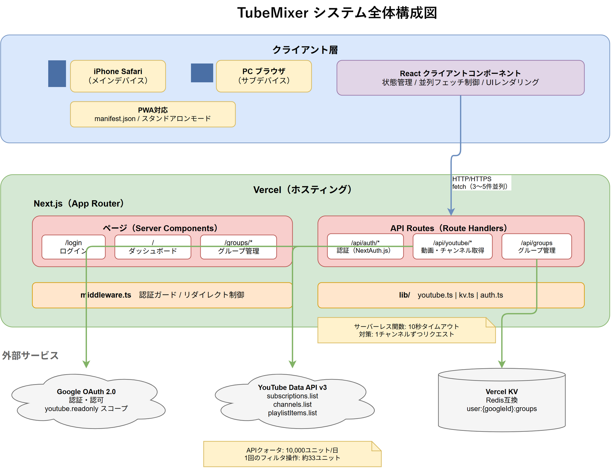

# TubeMixer アーキテクチャ設計書

## 1. システム全体構成

> **図表ファイル**: [system-architecture.drawio](diagrams/system-architecture.drawio) / [PNG版](diagrams/system-architecture.png)



<details>
<summary>テキスト版（参考）</summary>

```
┌─────────────────────────────────────────────────────┐
│                    クライアント                       │
│              (iPhone Safari / PC Browser)             │
│                                                       │
│  ┌─────────────┐  ┌──────────────┐  ┌─────────────┐ │
│  │ ログイン画面  │  │ ダッシュボード │  │ グループ管理 │ │
│  └──────┬──────┘  └──────┬───────┘  └──────┬──────┘ │
└─────────┼────────────────┼─────────────────┼────────┘
          │                │                 │
          ▼                ▼                 ▼
┌─────────────────────────────────────────────────────┐
│              Next.js on Vercel                       │
│                                                       │
│  ┌──────────────────┐  ┌───────────────────────────┐ │
│  │ API Routes        │  │ Server Components / Pages  │ │
│  │                    │  │                             │ │
│  │ /api/auth/*        │  │ /login                      │ │
│  │ /api/youtube/*     │  │ / (ダッシュボード)           │ │
│  │ /api/groups        │  │ /groups                     │ │
│  └────┬─────┬────────┘  │ /groups/[id]                │ │
│       │     │            └─────────────────────────────┘ │
└───────┼─────┼───────────────────────────────────────┘
        │     │
        ▼     ▼
┌────────────┐  ┌─────────────┐
│ YouTube    │  │ Vercel KV   │
│ Data API   │  │             │
│ v3         │  │ グループ設定 │
└────────────┘  └─────────────┘
```

</details>

## 2. レイヤー構造

### 2.1 プレゼンテーション層（Client Components）

- React クライアントコンポーネント
- ユーザー操作の受付、状態管理、UIレンダリング
- フロントエンドからAPI Routesへの並列リクエスト制御

### 2.2 アプリケーション層（API Routes）

- Next.js Route Handlers (`app/api/`)
- 認証チェック（NextAuth.jsセッション検証）
- YouTube API / Vercel KV へのアクセスを仲介
- 各エンドポイントは単一責務（1チャンネルの動画取得等）

### 2.3 外部サービス層

- **YouTube Data API v3**: チャンネル登録一覧、動画情報の取得（読み取り専用）
- **Vercel KV**: グループ設定の永続化（Redis互換）
- **Google OAuth 2.0**: 認証・認可

## 3. ディレクトリ構成

```
TubeMixer/
├── src/
│   ├── app/                          # Next.js App Router
│   │   ├── layout.tsx                # ルートレイアウト（SessionProvider）
│   │   ├── page.tsx                  # ダッシュボード（メイン画面）
│   │   ├── login/
│   │   │   └── page.tsx              # ログイン画面
│   │   ├── groups/
│   │   │   ├── page.tsx              # グループ管理一覧画面
│   │   │   └── [id]/
│   │   │       └── page.tsx          # グループ編集画面
│   │   └── api/
│   │       ├── auth/
│   │       │   └── [...nextauth]/
│   │       │       └── route.ts      # NextAuth.js ハンドラ
│   │       ├── youtube/
│   │       │   ├── subscriptions/
│   │       │   │   └── route.ts      # チャンネル登録一覧取得
│   │       │   └── videos/
│   │       │       └── route.ts      # チャンネル別動画取得
│   │       └── groups/
│   │           └── route.ts          # グループCRUD
│   ├── components/
│   │   ├── auth/
│   │   │   ├── LoginButton.tsx       # Googleログインボタン
│   │   │   └── LogoutButton.tsx      # ログアウトボタン
│   │   ├── groups/
│   │   │   ├── GroupList.tsx          # グループ一覧
│   │   │   ├── GroupCard.tsx          # グループカード
│   │   │   ├── GroupForm.tsx          # グループ作成/編集フォーム
│   │   │   └── ChannelPicker.tsx     # チャンネル選択（検索付き）
│   │   ├── dashboard/
│   │   │   ├── DateRangePicker.tsx    # 日付範囲選択
│   │   │   ├── FilterProgress.tsx    # フィルタ進捗表示
│   │   │   └── PlayUrlGenerator.tsx  # 再生URL生成・表示
│   │   ├── videos/
│   │   │   ├── VideoList.tsx         # 動画一覧
│   │   │   └── VideoCard.tsx         # 動画カード（サムネイル付き）
│   │   └── ui/
│   │       ├── Header.tsx            # グローバルヘッダー
│   │       ├── PullToRefresh.tsx     # プルトゥリフレッシュ
│   │       └── ErrorMessage.tsx      # エラー表示
│   ├── lib/
│   │   ├── auth.ts                   # NextAuth.js設定
│   │   ├── youtube.ts                # YouTube APIクライアント
│   │   └── kv.ts                     # Vercel KV操作
│   └── types/
│       ├── youtube.ts                # YouTube API関連の型
│       └── group.ts                  # グループ関連の型
├── public/
│   ├── manifest.json                 # PWAマニフェスト
│   └── icons/                        # PWAアイコン
├── middleware.ts                      # 認証ガード
├── next.config.js
├── tailwind.config.ts
├── tsconfig.json
└── package.json
```

### 各ディレクトリの責務

| ディレクトリ | 責務 |
|-------------|------|
| `app/` | ルーティング、ページコンポーネント、API Routes |
| `components/` | 再利用可能なUIコンポーネント（機能ドメインごとに分類） |
| `lib/` | 外部サービスとの通信ロジック、設定 |
| `types/` | TypeScript型定義 |
| `public/` | 静的ファイル、PWAアセット |

## 4. コンポーネント構成

### 4.1 ログイン画面

```
LoginPage
└── LoginButton (Google OAuth)
```

### 4.2 ダッシュボード（メイン画面）

```
DashboardPage
├── Header (アプリ名, グループ管理リンク, LogoutButton)
├── PullToRefresh
├── GroupList (選択モード)
│   └── GroupCard[] (タップで選択)
├── DateRangePicker (開始日, 終了日)
├── FilterButton (フィルタ実行)
├── FilterProgress (完了数/全数)
├── VideoList
│   ├── 全選択/全解除ボタン
│   └── VideoCard[] (チェックボックス付き)
└── PlayUrlGenerator
    ├── URL生成ボタン
    ├── 警告メッセージ (50本超)
    ├── URLコピーボタン
    └── YouTubeアプリで開くボタン
```

### 4.3 グループ管理画面

```
GroupsPage
├── Header
├── 新規作成ボタン → GroupForm (ダイアログ)
└── GroupList (管理モード)
    └── GroupCard[] (編集/削除ボタン付き)
```

### 4.4 グループ編集画面

```
GroupEditPage
├── Header (戻るボタン付き)
├── GroupForm (グループ名編集)
├── 割り当て済みチャンネル一覧 (削除ボタン付き)
└── ChannelPicker
    ├── 検索テキストフィールド (インクリメンタルサーチ)
    └── チャンネル一覧 (追加ボタン付き)
```

## 5. データフロー

### 5.1 認証フロー

```
ユーザー
  │
  ├─ 1. Googleログインボタン押下
  │     → NextAuth.js signIn("google")
  │     → Google OAuth 同意画面
  │     → コールバック
  │
  ├─ 2. NextAuth.js JWTコールバック
  │     → accessToken, refreshToken をJWTに格納
  │     → Cookieにセッション保存
  │
  └─ 3. 以降のAPIリクエスト
        → middleware.ts でセッション検証
        → API Routes内でJWTからaccessToken取得
        → YouTube APIに転送
```

### 5.2 動画取得フロー（並列リクエスト方式）

```
フロントエンド                        API Routes               YouTube API
    │                                    │                        │
    ├─ 1. グループ選択+日付指定           │                        │
    │                                    │                        │
    ├─ 2. GET /api/youtube/subscriptions ─┤                        │
    │                                    ├─ subscriptions.list ──→│
    │                                    ├─ channels.list ───────→│
    │     ← チャンネル一覧（uploadsPlaylistId付き）                │
    │                                    │                        │
    ├─ 3. グループに属するチャンネルを抽出  │                        │
    │                                    │                        │
    ├─ 4. 3〜5件ずつ並列で:              │                        │
    │     GET /api/youtube/videos ───────┤                        │
    │     ?channelId=xxx                 ├─ playlistItems.list ──→│
    │     &after=yyy&before=zzz          │                        │
    │     ← 動画リスト                    │                        │
    │                                    │                        │
    ├─ 5. 進捗更新（完了数/全数）         │                        │
    │     → 全チャンネル完了まで4を繰り返す │                       │
    │                                    │                        │
    └─ 6. 全動画を投稿日順にソートして表示  │                        │
```

### 5.3 グループ管理フロー

```
フロントエンド              API Routes              Vercel KV
    │                          │                      │
    ├─ GET /api/groups ────────┤                      │
    │                          ├─ KV.get() ──────────→│
    │  ← グループ一覧           │                      │
    │                          │                      │
    ├─ PUT /api/groups ────────┤                      │
    │  (更新後の全グループ)      ├─ KV.set() ──────────→│
    │  ← 保存完了               │                      │
```

## 6. 技術的判断

### 6.1 サーバーレス関数10秒制約への対応

- API Routeは1チャンネル分の動画取得に特化（1リクエストあたり数秒以内に完了）
- フロントエンドが並列数を制御（3〜5件同時）し、進捗表示を実現
- 全チャンネル一括取得は行わない

### 6.2 クライアントサイド状態管理

- フィルタ結果はダッシュボード内のReact state で管理（URLパラメータ不要）
- グループ一覧はAPIから取得後、ローカルstateで保持
- React の `useState` / `useReducer` で十分（外部状態管理ライブラリ不要）

### 6.3 PWA対応

- `manifest.json` でアプリ名・アイコン・テーマカラーを設定
- `display: "standalone"` でフルスクリーン起動
- Service Worker は不要（オンライン前提）
- `next-pwa` 等のライブラリは不使用（manifest.jsonの手動配置で十分）

### 6.4 YouTubeアプリ連携

- `youtube://` スキームでアプリ起動を試行
- タイムアウト後にフォールバックとして `https://www.youtube.com/watch_videos?video_ids=...` をブラウザで開く
