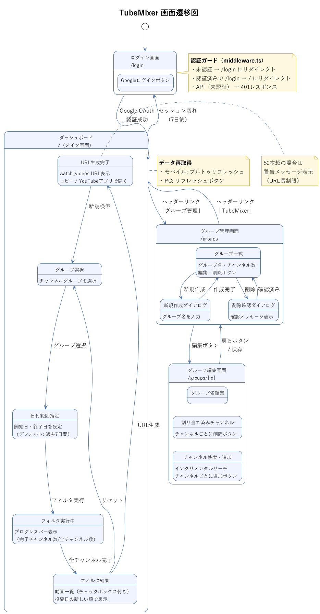

# TubeMixer サイトマップ

## 1. URL構造

| URL | ページ | 認証 | 説明 |
|-----|--------|------|------|
| `/login` | ログイン画面 | 不要 | Googleログインボタン |
| `/` | ダッシュボード | 必要 | メイン画面（グループ選択→フィルタ→結果→URL生成） |
| `/groups` | グループ管理一覧 | 必要 | グループの作成・削除 |
| `/groups/[id]` | グループ編集 | 必要 | グループ名変更・チャンネル割り当て |

- フィルタ結果画面は独立URLを持たず、ダッシュボード(`/`)内のクライアントサイド状態遷移で実現

---

## 2. 画面遷移図

> **図表ファイル**: [screen-transition.puml](diagrams/screen-transition.puml) / [PNG版](diagrams/screen-transition.png)



<details>
<summary>テキスト版（参考）</summary>

```
                    ┌──────────┐
                    │  /login  │
                    │ ログイン  │
                    └────┬─────┘
                         │ Googleログイン成功
                         ▼
                    ┌──────────┐
          ┌────────│    /     │────────┐
          │        │ダッシュ   │        │
          │        │ボード    │        │
          │        └────┬─────┘        │
          │             │              │
          │    (クライアントサイド     │
          │     状態遷移)             │
          │             │              │
          │     ┌───────┴───────┐      │
          │     ▼               ▼      │
          │  グループ選択    日付範囲    │
          │     │           指定       │
          │     └───────┬───────┘      │
          │             ▼              │
          │      フィルタ実行           │
          │      (進捗表示)            │
          │             ▼              │
          │      フィルタ結果           │
          │      (動画一覧)            │
          │             ▼              │
          │      URL生成・表示         │
          │                            │
          │  ヘッダーリンク             │ ヘッダーリンク
          ▼                            ▼
    ┌──────────┐               ┌──────────────┐
    │ /groups  │──────────────→│ /groups/[id] │
    │グループ   │   編集ボタン   │ グループ編集  │
    │管理一覧   │               │              │
    └──────────┘←──────────────┘
                   戻るボタン
```

### セッション切れ時の遷移

```
任意のページ ──(セッション切れ検知)──→ /login
```

</details>

---

## 3. 各画面の機能マッピング

### 3.1 ログイン画面 (`/login`)

| 要素 | 説明 |
|------|------|
| アプリロゴ・名前 | TubeMixer ブランディング |
| Googleログインボタン | NextAuth.js `signIn("google")` を呼び出し |

| 使用API | 用途 |
|---------|------|
| `/api/auth/[...nextauth]` | OAuth認証処理 |

**振る舞い**:
- 認証済みユーザーがアクセスした場合 → `/` にリダイレクト

---

### 3.2 ダッシュボード (`/`)

メイン画面。グループ選択からURL生成までを1画面内で完結する。

| 要素 | 説明 |
|------|------|
| **ヘッダー** | アプリ名、グループ管理リンク(`/groups`)、ログアウトボタン |
| **グループ一覧** | カード形式、タップで選択（複数選択不可） |
| **日付範囲ピッカー** | 開始日・終了日（デフォルト: 過去7日間） |
| **フィルタ実行ボタン** | グループ選択+日付指定後に押下 |
| **進捗バー** | 「3/20チャンネル完了」のように表示 |
| **動画一覧** | サムネイル・タイトル・チャンネル名・投稿日、チェックボックス付き |
| **全選択/全解除ボタン** | 動画の一括選択制御 |
| **URL生成ボタン** | 選択した動画からwatch_videos URLを生成 |
| **URL表示エリア** | 生成URL、コピーボタン、YouTubeアプリで開くボタン |
| **50本超警告** | 選択動画数が50を超える場合に表示 |
| **プルトゥリフレッシュ** | グループ一覧の再取得（モバイル） |
| **リフレッシュボタン** | グループ一覧の再取得（PC） |

| 使用API | 用途 |
|---------|------|
| `GET /api/groups` | グループ一覧取得 |
| `GET /api/youtube/subscriptions` | チャンネル登録一覧取得 |
| `GET /api/youtube/videos` | チャンネル別動画取得（並列） |

**状態遷移フロー**:

```
初期状態 → グループ選択済み → 日付指定済み → フィルタ実行中 → 結果表示 → URL生成済み
```

---

### 3.3 グループ管理一覧 (`/groups`)

| 要素 | 説明 |
|------|------|
| **ヘッダー** | アプリ名（`/`へのリンク）、ログアウトボタン |
| **新規作成ボタン** | グループ名入力ダイアログを表示 |
| **グループ一覧** | グループ名、所属チャンネル数 |
| **各グループの操作** | 編集ボタン（`/groups/[id]`へ遷移）、削除ボタン（確認ダイアログ付き） |

| 使用API | 用途 |
|---------|------|
| `GET /api/groups` | グループ一覧取得 |
| `PUT /api/groups` | グループ作成・削除後の保存 |

---

### 3.4 グループ編集画面 (`/groups/[id]`)

| 要素 | 説明 |
|------|------|
| **ヘッダー** | 戻るボタン（`/groups`へ）、ログアウトボタン |
| **グループ名編集** | テキスト入力フィールド |
| **割り当て済みチャンネル** | チャンネル名・アイコン一覧、各チャンネルに削除ボタン |
| **チャンネル追加セクション** | 検索テキストフィールド（インクリメンタルサーチ） |
| **チャンネル検索結果** | チャンネル名・アイコン一覧、各チャンネルに追加ボタン |
| **保存ボタン** | 変更を保存 |

| 使用API | 用途 |
|---------|------|
| `GET /api/groups` | 現在のグループ設定取得 |
| `PUT /api/groups` | 変更後のグループ設定保存 |
| `GET /api/youtube/subscriptions` | チャンネル登録一覧取得（追加候補表示用） |

**注意**: `[id]` はグループのUUID。存在しないIDの場合は `/groups` にリダイレクト。

---

## 4. 認証ガード (`middleware.ts`)

### 4.1 リダイレクトルール

| 条件 | アクセス先 | 動作 |
|------|-----------|------|
| 未認証 | `/`, `/groups`, `/groups/[id]` | → `/login` にリダイレクト |
| 認証済み | `/login` | → `/` にリダイレクト |
| 未認証 | `/api/youtube/*`, `/api/groups` | → `401 Unauthorized` レスポンス |
| - | `/api/auth/*` | 認証チェックなし（NextAuth.jsが処理） |
| - | `/_next/*`, `/icons/*`, `/manifest.json` | 認証チェックなし（静的ファイル） |

### 4.2 middleware.ts の対象パス

```typescript
export const config = {
  matcher: [
    "/",
    "/groups/:path*",
    "/login",
    "/api/youtube/:path*",
    "/api/groups",
  ],
};
```

---

## 5. ナビゲーション構造

### 5.1 グローバルヘッダー

```
┌──────────────────────────────────────────────────┐
│  TubeMixer          グループ管理    ログアウト     │
│  (/ へのリンク)      (/groups)      (signOut)     │
└──────────────────────────────────────────────────┘
```

- モバイル: コンパクトなヘッダー。画面数が少ないためタブバーは不要
- PC: 同じヘッダー構成

### 5.2 ページ内ナビゲーション

| 画面 | ナビゲーション要素 |
|------|------------------|
| `/` | ヘッダーのみ |
| `/groups` | ヘッダー + 各グループの編集ボタン |
| `/groups/[id]` | ヘッダー + 戻るボタン |
| `/login` | なし（ヘッダーなし） |

### 5.3 戻る操作

- ブラウザの戻るボタン（履歴ベース）
- グループ編集画面の明示的な戻るボタン（`/groups` へ遷移）
